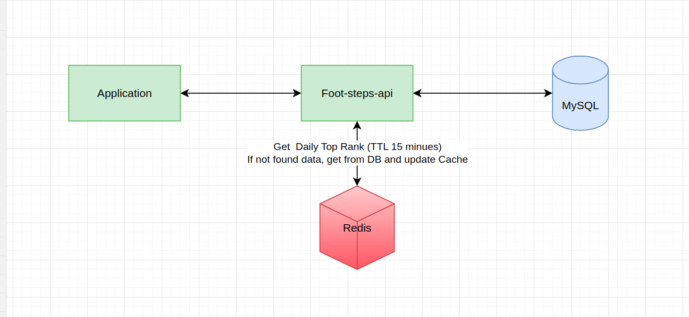
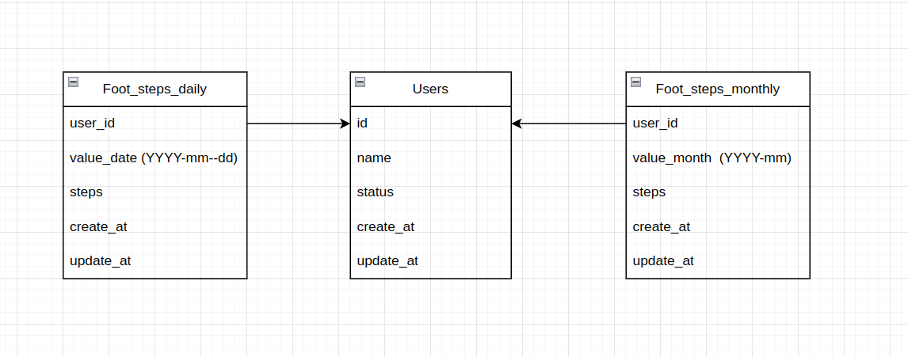

### Footsteps service
This service provide APIs for tracking footsteps.

### System design
I came up with 2 system designs and choice the second one to implement because of some benefits listed in second design:  

#### 1. The first one I use Kafka to handle update footsteps request.
- Able to scale, easy to tracking messages consumers to scale up services
- Keep the update requests, so we will not get message lost
- Easily to update footsteps to data lake, data warehouse


#### 2. The second one I update footsteps directly with transaction
- I send update request by `total footsteps of date` each 5 - 15 minutes, so if we get error with some request, next request still update correct data
- I think this is footsteps, not money transaction. So it's fine if we miss some request but then eventually consistent afterward
- Easily to implement but still done the work



### Database

- I use `foot_steps_daily` as a trust source. If there are some inconsistent with steps in other `foot_steps` table, we with need to sync data from `foot_steps_daily`



### API documentation Postman: proof of work

[API documentation Postman: proof of work](https://documenter.getpostman.com/view/8447364/2s9YC7SWhj#0204ec6e-c7af-4da4-91bf-b076a3c05279)

### Implementation service and database

- [foot-steps-api](./foot-steps-api)  
- [Create table MySQL](./query-mysql/query-mysql.sql)

### API documentation

#### 1. API record footsteps in current date from application.
   - Url: api/v1/footsteps/me/update
   - Method: POST
   - Input body:
   ```
   {
       "user_id": 0,
       "value_date": "YYYY-mm-dd",
       "foot_steps": 5
   }
   ```
   - Output:
   ```
   {
       "success": true,
       "message": "Success",
   }
   ```
   - Logic:  
      + Get update request each 5 - 15 minutes interval.
      + If not found `(user_id, value_date)` in `foot_steps_daily` table
        + `added_steps` = `foot_steps`
        + Insert new row
      + Else
        + `added_steps` = `foot_steps` - `oldRow.steps`
        + If `added_steps` > 0
          + Update that row with new `foot_steps`
      + Then if `added_steps` > 0
        + If not found `(user_id, value_month(from value_date))` in `foot_steps_monthly` table
          + Insert new row with `added_steps`
        + Else
          + Update that row with `oldRow.steps` + `added_steps`
#### 2. API get daily top rank to view on application.
   - Url: api/v1/footsteps/daily/top-rank
   - Method: GET
   - Input query:
   ```
    - "user_id": 0,
    - "value_date": "YYYY-mm-dd" //nullable
   ```
   - Output:
   ```
    {
       "success": true,
       "message": "Success",
       "data": {
           "value_date": "YYYY-mm-dd",
           "items": [
               {
                    "user_id": 0,
                    "name": "string"
                    "steps": 5
                },
                {
                    "user_id": 1,
                    "name": "string"
                    "steps": 3
                },
            ]
        }
    }
   ```
   - Logic:<br>
       + Get `value_date`, if `value_date` empty get `current_date`
       + Get top rank for `Redis cache`
         + Key: `FOOTSTEPS_DAILY_TOP_RANK_@date_@limit`
         + TTL: 15 minutes
       + `Redis cache` empty then get top rank from `MySQL`
         + `Join` `foot_steps_daily` with `users` table to get more user information
         + check `where` `value_date` column equal `date` input
         + get `order by steps` and get `limit`
       + Update data from `MySQL` to `Redis cache` with `Time_to_live` = 15 minutes
       + Return top rank to response
#### 3. API get current weekly footsteps to view on application.
   - Url: api/v1/footsteps/me/weekly
   - Method: GET
   - Input query:
   ```
    - "user_id": 0,
    - "value_date": "YYYY-mm-dd" //nullable
   ```
   - Output:
   ```
    {
        "success": true,
        "message": "Success",
        "data": {
            "user_id": 0,
            "start_of_week": "YYYY-mm-dd",
            "end_of_week": "YYYY-mm-dd",
            "steps": 0
        }
    }
   ```
   - Logic:<br>
       + Get `value_date`, if `value_date` empty get `current_date`
       + Get `start_of_week` and `end_of_week` from `date`
       + `sum(steps)` all row between `start_of_week` and `end_of_week`
       + return `sum(steps)`
#### 4. API get current monthly footsteps to view on application.
   - Url: api/v1/footsteps/me/monthly
   - Method: GET
   - Input query:
   ```
    - "user_id": 0,
    - "value_month": "YYYY-mm" //nullable
   ```
   - Output:
   ```
   {
       "success": true,
       "message": "Success",
       "data": {
           "user_id": 0,
           "value_month": "YYYY-mm",
           "steps": 0
       }
   }
   ```
   - Logic:<br>
       + Get `value_month`, if `value_month` empty get `current_month`
       + Get `steps` by that `month`
       + return `steps`

