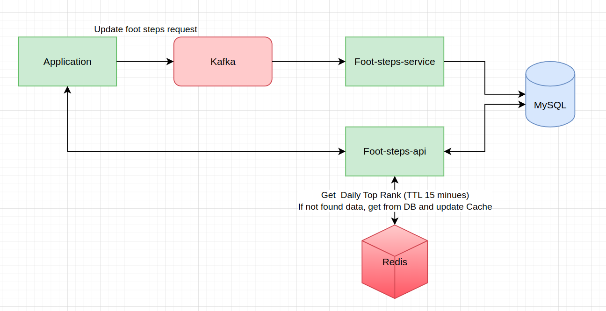

## Footsteps service
This service provide APIs for tracking footsteps.

### System design
I came up with 2 system designs and choice the second one to implement because of some benefits listed in second design:  

#### 1. The first one I use Kafka to handle update footsteps request.
- Able to scale, easy to tracking messages consumers to scale up services
- Keep the update requests, so we will not get message lost
- Easily to update footsteps to data lake, data warehouse

#### 2. The second one I update footsteps directly with transaction
- I send update request by `total footsteps of date` each 5 - 15 minutes, so if we get error with some request, next request still update correct data
- I think this is footsteps, not money transaction. So it's fine if we miss some request but then eventually consistent afterward
- Easily to implement but still done the work

### Database

- I use `foot_steps_daily` as a trust source. If there are some inconsistent with steps in other `foot_steps` table, we with need to sync data from `foot_steps_daily`

### API documentation Postman: proof of work

[API documentation Postman: proof of work](https://documenter.getpostman.com/view/8447364/2s9YC7SWhj#0204ec6e-c7af-4da4-91bf-b076a3c05279)

### Implementation service and database

- [foot-steps-api](./foot-steps-api)  
- [Create table MySQL](./query-mysql/query-mysql.sql)

### API documentation logic

- [API documentation logic](./api_documentaion_logic.md)